# moon-landing-hoax-gaia

Add your description here

<!-- badges:start -->
<!-- badges:end -->

## Overview

> [!TIP]
> **Reasoning graph information gain: `0.0 bits`**
>
> Total mutual information between leaf premises and exported conclusions — measures how much the reasoning structure reduces uncertainty about the results.

```mermaid
---
config:
  flowchart:
    rankSpacing: 80
    nodeSpacing: 30
---
graph TB
    moon_landing_real["★ Moon landings were real\n(0.50 → 1.00)"]:::exported
    obs_retroreflector_us["Laser ranging from Western observatories\n(0.99 → 1.00)"]:::premise
    obs_retroreflector_china["Laser ranging from Chinese observatories\n(0.99 → 1.00)"]:::premise
    alt_retroreflector_unmanned["Alternative: unmanned placement of retroreflectors\n(0.15 → 0.15)"]:::premise
    obs_moon_rocks["Apollo lunar samples: properties and independent analysis\n(0.99 → 1.00)"]:::premise
    obs_soviet_samples_match["Soviet Luna samples match Apollo samples\n(0.98 → 1.00)"]:::premise
    obs_china_sample["Chinese analysis of gifted Apollo sample\n(0.97 → 1.00)"]:::premise
    alt_rocks_fake["Alternative: fabricated lunar samples\n(0.01 → 0.01)"]:::premise
    obs_lro_images["LRO photographs of Apollo landing sites\n(0.98 → 1.00)"]:::premise
    obs_japan_selene["Japan SELENE imaging of Apollo 15 site\n(0.97 → 1.00)"]:::premise
    obs_india_chandrayaan["India Chandrayaan imaging of Apollo sites\n(0.96 → 1.00)"]:::premise
    alt_imaging_fake["Alternative: fabricated orbital images\n(0.01 → 0.01)"]:::premise
    obs_soviet_tracked["Soviet independent tracking of Apollo missions\n(0.95 → 1.00)"]:::premise
    obs_soviet_encyclopedia["Soviet Encyclopedia acknowledgment\n(0.98 → 1.00)"]:::premise
    obs_soviet_luna15["Soviet Luna 15 coordination with Apollo 11\n(0.97 → 1.00)"]:::premise
    alt_soviet_complicit["Alternative: Soviet complicity or deception\n(0.01 → 0.01)"]:::premise
    obs_400k_people["400,000+ people involved in Apollo\n(0.99 → 1.00)"]:::premise
    obs_ouyang_endorsement["China's chief lunar scientist endorses Apollo authenticity\n(0.98 → 1.00)"]:::premise
    real_xor_hoax["real_xor_hoax\n(0.50 → 1.00)"]:::premise
    moon_landing_hoax["★ Moon landings were a hoax\n(0.05 → 0.00)"]:::exported
    strat_0(["infer\n0.00 bits"]):::weak
    alt_imaging_fake --> strat_0
    alt_retroreflector_unmanned --> strat_0
    alt_rocks_fake --> strat_0
    alt_soviet_complicit --> strat_0
    obs_400k_people --> strat_0
    obs_china_sample --> strat_0
    obs_india_chandrayaan --> strat_0
    obs_japan_selene --> strat_0
    obs_lro_images --> strat_0
    obs_moon_rocks --> strat_0
    obs_ouyang_endorsement --> strat_0
    obs_retroreflector_china --> strat_0
    obs_retroreflector_us --> strat_0
    obs_soviet_encyclopedia --> strat_0
    obs_soviet_luna15 --> strat_0
    obs_soviet_samples_match --> strat_0
    obs_soviet_tracked --> strat_0
    strat_0 --> moon_landing_real
    oper_0{{"⊕"}}
    moon_landing_real --- oper_0
    moon_landing_hoax --- oper_0
    oper_0 --- real_xor_hoax

    classDef premise fill:#ddeeff,stroke:#4488bb,color:#333
    classDef exported fill:#d4edda,stroke:#28a745,stroke-width:2px,color:#333
    classDef weak fill:#fff9c4,stroke:#f9a825,stroke-dasharray: 5 5,color:#333
    classDef contra fill:#ffebee,stroke:#c62828,color:#333
```

## Conclusions

| Label | Content | Prior | Belief |
|-------|---------|-------|--------|
| moon_landing_hoax | The Apollo Moon landings were faked: NASA staged the landings in a film studi... | 0.05 | 0.00 |
| moon_landing_real | The Apollo Moon landings (1969–1972) were real: NASA astronauts traveled to t... | 0.50 | 1.00 |

<!-- content:start -->
<!-- content:end -->
