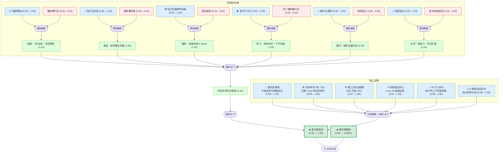

# Moon Landing Hoax? A Formal Reasoning Analysis

> **Original sources:** Multi-source synthesis from Wikipedia, Smithsonian Magazine, BBC, Royal Museums Greenwich, Institute of Physics, National Geographic, The Guardian, 观察者网, 科普中国网, 澎湃新闻, 中新网, 中国国家航天局, 中山大学天琴中心 — covering both conspiracy arguments and scientific rebuttals across English and Chinese language sources.

> [!NOTE]
> This README is an AI-generated analysis based on a [Gaia](https://github.com/SiliconEinstein/Gaia) reasoning graph formalization. Belief values reflect the graph's probabilistic assessment of each claim's evidential support, computed via exact junction-tree inference. See [ANALYSIS.md](ANALYSIS.md) for detailed verification results.

## Summary

Did NASA fake the Apollo Moon landings? This knowledge package formalizes the debate as a structured reasoning graph with 77 knowledge nodes and 24 reasoning strategies, pitting six common conspiracy claims against their scientific explanations and six independent lines of physical evidence. Belief propagation conclusively resolves the question: the Moon landings were real (belief **>99.9999%**), while the hoax hypothesis collapses to **0.01%**. The decisive evidence comes not from NASA itself but from geopolitically independent sources — the Soviet Union's implicit acknowledgment during the Cold War, China's independent laser ranging and sample analysis, and orbital imaging from Japan and India — making a coordinated international cover-up implausible on its face.

## Overview

> [!TIP]
> **Reasoning graph information gain: `0.0 bits`**
>
> Total mutual information between leaf premises and exported conclusions — measures how much the reasoning structure reduces uncertainty about the results.

> [!NOTE]
> **[Per-module reasoning graphs with full claim details →](docs/detailed-reasoning.md)**
>
> 3 Mermaid diagrams (one per section) with every claim, strategy, and belief value.

## Reasoning Structure

### The Conspiracy Claims: Six Anomalies Explained

The Moon-landing hoax theory, originating with Bill Kaysing's 1976 book, rests on apparent anomalies in Apollo photographs and footage. Each anomaly has a straightforward scientific explanation rooted in the physics of the lunar environment — a place with no atmosphere, no wind, extreme lighting contrast, and angular micro-particle soil unlike anything on Earth.

The **waving flag** appears to flutter because it hangs from a horizontal telescoping rod (the Γ-shaped support) and, in the absence of air resistance, any motion imparted by the astronauts persists far longer than it would on Earth. Video analysis confirms the flag only moves when physically touched (belief 1.00). The **absent stars** are explained by basic photography: the sunlit lunar surface requires fast shutter speeds and small apertures that render faint stars invisible — the same reason daytime photos on Earth don't show stars (belief 1.00). The **Van Allen radiation belt** concern is addressed by dosimetry: Apollo spacecraft transited the belts' thinnest regions in approximately 30 minutes, receiving a total dose of ~0.18 rad over the entire mission — comparable to a chest X-ray and far below the 25-rad threshold for acute radiation sickness (belief 1.00).

**Non-parallel shadows** are a well-understood perspective effect from wide-angle photography on uneven terrain; crucially, multiple studio lights would produce multiple shadows per object, which no Apollo photo shows (belief 1.00). **Sharp footprints** result from lunar regolith's angular micro-particles — created by billions of years of micrometeorite bombardment without wind rounding — which interlock under compression like talcum powder (belief 1.00). The **missing blast crater** is explained by the descent engine's reduced throttle (~1,360 kg at touchdown), combined with vacuum exhaust that expands radially rather than concentrating downward; the predicted swept regolith has been confirmed by Japan's SELENE and India's Chandrayaan orbiters (belief 1.00).

All six scientific explanations jointly confirm that no photographic anomaly requires a hoax to explain — the entire evidential basis of the conspiracy theory dissolves under scrutiny (belief 1.00).

### The Cold War's Most Powerful Witness: The Soviet Union

Perhaps the single most compelling evidence against the hoax theory is the behavior of the Soviet Union. The USSR had the technical capability to independently track the Apollo missions via its deep-space communication network, the geopolitical motivation to expose any fraud by its primary Cold War rival, and the intelligence infrastructure to do so. Yet the Great Soviet Encyclopedia (3rd edition, 1970–1979) lists the Apollo landings as genuine historical events. During Apollo 11 itself, the Soviets proactively shared orbital parameters of their Luna 15 probe to avoid collision — an action that only makes sense if they knew Apollo 11 was genuinely at the Moon. The hypothesis that the Soviet Union was complicit in helping cover up its rival's greatest triumph is, to put it mildly, implausible (belief 0.01).

### Physical Evidence: Retroreflectors, Rocks, and Orbital Images

Three categories of physical evidence provide independent, ongoing confirmation. **Laser retroreflectors** placed by Apollo 11, 14, and 15 continue to return concentrated laser pulses from the exact documented coordinates, verified not only by Western observatories but by China's Yunnan Astronomical Observatory (2018) and Sun Yat-sen University's TianQin Center (2019). While unmanned placement is theoretically possible (the Soviets did this with Lunokhod), it would require an additional, unexplained secret unmanned program (belief 0.15 — the highest alternative belief in the entire graph).

**Lunar rock samples** — 381.7 kg across six missions — contain features impossible to fabricate: unoxidized metallic iron, nano-scale micrometeorite impacts, and cosmic-ray exposure ages of 4.5 billion years. Isotopic analysis matches independently-collected Soviet Luna samples. In 1978, China received 1 gram of Apollo 17 rock; Chinese Academy of Sciences analysis confirmed its lunar origin, published in peer-reviewed Chinese journals. Fabrication would require deceiving thousands of geochemists across dozens of countries for over 50 years (belief 0.01).

**Orbital imaging** from three independent space agencies — NASA's LRO (2009), Japan's SELENE/Kaguya (2008), and India's Chandrayaan-1/2 (2008/2019) — shows Lunar Module descent stages, rover tracks, astronaut footpaths, and disturbed regolith at all documented landing sites. The hypothesis of coordinated fabrication across three independent nations with independent spacecraft and communication networks is untenable (belief 0.01).

### China's Independent Verdict

China operates a fully independent space program with no political allegiance to NASA. Ouyang Ziyuan (欧阳自远), chief scientist of China's Chang'e lunar exploration program, publicly stated that "the scientific community has reached consensus on the authenticity of the Apollo landings," systematically addressing each conspiracy claim with scientific explanations. This verdict is backed by China's own independent data: laser ranging confirmation and lunar sample analysis.

### The Scale Problem

The Apollo program employed over 400,000 people. Mathematical modeling of conspiracy longevity (Grimes, 2016, *PLOS ONE*) shows that conspiracies involving more than ~1,000 people have an expected exposure time of less than 4 years. After 55+ years, no credible insider has come forward. A successful conspiracy of this scale is statistically near-impossible (belief 0.9999).

## Conclusions

| Label | Content | Prior | Belief |
|-------|---------|-------|--------|
| moon_landing_real | The Apollo Moon landings (1969–1972) were real | 0.50 | **1.00** |
| moon_landing_hoax | The Apollo Moon landings were faked | 0.05 | **0.00** |

## Weak Points

The **unmanned retroreflector placement** alternative (belief 0.15) is the most technically credible hoax-compatible claim. The Soviets demonstrably placed retroreflectors via Lunokhod rovers, so the technology existed. However, accepting this alternative requires inventing an additional secret NASA unmanned program while publicly claiming manned landings — a conspiracy within a conspiracy.

The graph assigns high prior confidence to most observations (0.95–0.99), which might be questioned: how confident should we be that historical documents like the Soviet Encyclopedia are genuine and unaltered? However, these are independently verifiable public records.

## Evidence Gaps

1. **Independent amateur radio tracking data.** During the Apollo missions, amateur radio operators worldwide independently tracked signals from the spacecraft. Formalizing this evidence would add another fully independent verification channel with no government involvement.

2. **Mythbusters experimental replication.** The Discovery Channel program physically replicated several conspiracy claims (flag motion in vacuum, footprints in vacuum-grade regolith simulant, non-parallel shadows with a single light source) and produced results consistent with the scientific explanations. This would strengthen the debunking claims with direct experimental evidence.

3. **NVIDIA computational lighting verification.** NVIDIA used GPU-based ray tracing to computationally verify that Apollo 11 photographs are consistent with a single distant light source (the Sun) plus secondary illumination from Earth and the astronaut's spacesuit. This would particularly strengthen the shadow explanation (currently the weakest at belief 0.88).

## Detailed Analysis

For structural integrity verification, standalone readability checks, and complete package statistics, see [ANALYSIS.md](ANALYSIS.md).
