# moon-landing-hoax-gaia

Add your description here

## Core hypotheses: Was the Apollo Moon landing real or faked?

#### The Space Race and Apollo program

📋 `space_race`

> During the Cold War (1957–1972), the United States and the Soviet Union competed in the 'Space Race.' NASA's Apollo program aimed to land humans on the Moon, culminating in Apollo 11 on July 20, 1969. Six Apollo missions (11, 12, 14, 15, 16, 17) successfully landed on the Moon between 1969 and 1972.

#### Origin of the hoax theory

📋 `hoax_origin`

> The Moon-landing conspiracy theory originated with Bill Kaysing's 1976 book 'We Never Went to the Moon: America's Thirty Billion Dollar Swindle.' Kaysing held a B.A. in English and worked briefly as a technical writer at Rocketdyne in the 1950s. The theory gained traction through the 2001 Fox TV special 'Conspiracy Theory: Did We Land on the Moon?'

#### Moon landings were real ★

📌 `moon_landing_real`   |   Belief: **1.00**

> The Apollo Moon landings (1969–1972) were real: NASA astronauts traveled to the Moon, walked on its surface, conducted experiments, and returned safely to Earth. This is supported by the scientific community, multiple independent space agencies, and 381.7 kg of returned lunar samples.

🔗 **noisy_and**([China's chief lunar scientist endorses Apollo authenticity](#obs_ouyang_endorsement), [Chinese analysis of gifted Apollo sample](#obs_china_sample), [Laser ranging from Chinese observatories](#obs_retroreflector_china))

Reasoning

China has no political allegiance to NASA and operates a fully independent space program. @obs_ouyang_endorsement represents the scientific judgment of China's top lunar scientist, backed by @obs_china_sample (independent sample analysis) and @obs_retroreflector_china (independent laser ranging). This constitutes a strong, geopolitically independent endorsement.

#### Moon landings were a hoax ★

📌 `moon_landing_hoax`   |   Prior: 0.05   |   Belief: **0.00**

> The Apollo Moon landings were faked: NASA staged the landings in a film studio on Earth to win the Space Race, and all photographic/video evidence was fabricated. The 400,000+ people involved in the Apollo program were either complicit or deceived.

#### real_xor_hoax

📌 `real_xor_hoax`   |   Belief: **1.00**

> opposite_truth(A, B)

## Conspiracy theory claims and their scientific debunking.

```mermaid
graph TD
    lunar_vacuum["Lunar vacuum environment"]:::setting
    obs_flag_waves["Observation: flag appears to wave (1.00)"]:::premise
    flag_science["Scientific explanation: flag design + vacuum inertia (1.00)"]:::derived
    alt_flag_studio["Hoax explanation: studio air currents (0.05)"]:::premise
    obs_no_stars["Observation: no stars in photos (1.00)"]:::premise
    no_stars_science["Scientific explanation: camera exposure settings (1.00)"]:::derived
    alt_no_stars_studio["Hoax explanation: studio backdrop (0.05)"]:::premise
    obs_radiation_belt["Observation: Apollo transited the Van Allen belts (1.00)"]:::premise
    radiation_safe["Scientific explanation: minimal radiation dose via fast transit (1.00)"]:::derived
    alt_radiation_lethal["Hoax explanation: lethal radiation barrier (0.02)"]:::premise
    obs_shadows["Observation: non-parallel shadows (1.00)"]:::premise
    shadows_science["Scientific explanation: perspective + uneven terrain (1.00)"]:::derived
    alt_shadows_studio["Hoax explanation: multiple studio lights (0.03)"]:::premise
    obs_footprints["Observation: sharp footprints in lunar soil (1.00)"]:::premise
    footprints_science["Scientific explanation: angular regolith holds imprints (1.00)"]:::derived
    alt_footprints_fake["Hoax explanation: wet sand on Earth (0.05)"]:::premise
    obs_no_crater["Observation: no blast crater under LM (1.00)"]:::premise
    no_crater_science["Scientific explanation: low thrust + vacuum gas expansion (1.00)"]:::derived
    alt_crater_studio["Hoax explanation: LM was a studio prop (0.03)"]:::premise
    all_anomalies_explained["All conspiracy anomalies have scientific explanations (1.00)"]:::derived
    strat_0(["abduction"]):::weak
    obs_flag_waves --> strat_0
    alt_flag_studio --> strat_0
    lunar_vacuum -.-> strat_0
    strat_0 --> flag_science
    strat_1(["abduction"]):::weak
    obs_no_stars --> strat_1
    alt_no_stars_studio --> strat_1
    strat_1 --> no_stars_science
    strat_2(["abduction"]):::weak
    obs_radiation_belt --> strat_2
    alt_radiation_lethal --> strat_2
    strat_2 --> radiation_safe
    strat_3(["abduction"]):::weak
    obs_shadows --> strat_3
    alt_shadows_studio --> strat_3
    strat_3 --> shadows_science
    strat_4(["abduction"]):::weak
    obs_footprints --> strat_4
    alt_footprints_fake --> strat_4
    strat_4 --> footprints_science
    strat_5(["abduction"]):::weak
    obs_no_crater --> strat_5
    alt_crater_studio --> strat_5
    strat_5 --> no_crater_science
    strat_6(["noisy_and"]):::weak
    flag_science --> strat_6
    no_stars_science --> strat_6
    radiation_safe --> strat_6
    shadows_science --> strat_6
    footprints_science --> strat_6
    no_crater_science --> strat_6
    strat_6 --> all_anomalies_explained

    classDef setting fill:#f0f0f0,stroke:#999,color:#333
    classDef premise fill:#ddeeff,stroke:#4488bb,color:#333
    classDef derived fill:#ddffdd,stroke:#44bb44,color:#333
    classDef question fill:#fff3dd,stroke:#cc9944,color:#333
    classDef background fill:#f5f5f5,stroke:#bbb,stroke-dasharray: 5 5,color:#333
    classDef orphan fill:#fff,stroke:#ccc,stroke-dasharray: 5 5,color:#333
    classDef external fill:#fff,stroke:#aaa,stroke-dasharray: 3 3,color:#333
    classDef weak fill:#fff9c4,stroke:#f9a825,stroke-dasharray: 5 5,color:#333
    classDef contra fill:#ffebee,stroke:#c62828,color:#333
```

#### Lunar vacuum environment

📋 `lunar_vacuum`

> The Moon has no atmosphere. In a vacuum there is no air resistance, so once an object is set in motion it continues to oscillate far longer than it would on Earth.

#### Observation: flag appears to wave

📌 `obs_flag_waves`   |   Prior: 0.95   |   Belief: **1.00**

> In Apollo mission footage and photographs, the American flag planted on the lunar surface appears to ripple and wave as though blown by wind.

#### Scientific explanation: flag design + vacuum inertia

📌 `flag_science`   |   Belief: **1.00**

> The flag's apparent waving is explained by its Γ-shaped support rod (a horizontal telescoping arm kept the fabric unfurled) and the absence of air resistance. When astronauts handled the flagpole, inertial oscillations persisted far longer than on Earth. In video footage the flag is motionless except when physically touched.

🔗 **abduction**([Observation: flag appears to wave](#obs_flag_waves), [Hoax explanation: studio air currents](#alt_flag_studio))

Reasoning

The @flag_science explanation is fully consistent with the physics of vacuum inertia and the known Γ-shaped support rod design. Video analysis confirms the flag only moves when astronauts touch it — there is no continuous fluttering as wind would produce. The @alt_flag_studio explanation is contradicted by the motion pattern: studio air currents would cause continuous random fluttering.

#### Hoax explanation: studio air currents

📌 `alt_flag_studio`   |   Prior: 0.05   |   Belief: **0.05**

> The flag waves because the footage was shot in an Earth-based studio with air currents from ventilation or movement of crew.

#### Observation: no stars in photos

📌 `obs_no_stars`   |   Prior: 0.95   |   Belief: **1.00**

> None of the Apollo mission photographs show stars in the lunar sky, despite the Moon having no atmosphere to scatter light.

#### Scientific explanation: camera exposure settings

📌 `no_stars_science`   |   Belief: **1.00**

> Stars are absent from Apollo photos because all manned missions landed during lunar daytime. The sunlit lunar surface has an albedo of ~0.12, requiring fast shutter speeds (1/125–1/250 s) and small apertures (f/5.6–f/11) to properly expose the bright foreground. At these camera settings, stars (apparent magnitude > +1) are far too dim to register on film. The same effect occurs on Earth: daytime photos rarely show stars.

🔗 **abduction**([Observation: no stars in photos](#obs_no_stars), [Hoax explanation: studio backdrop](#alt_no_stars_studio))

Reasoning

The absence of stars is a well-understood photographic effect. Any camera set to expose a sunlit landscape will render stars invisible — this is trivially reproducible on Earth by photographing a nighttime sports field under floodlights. @no_stars_science provides a complete, quantitative explanation without invoking a conspiracy. @alt_no_stars_studio posits an unnecessary and unfalsifiable additional claim.

#### Hoax explanation: studio backdrop

📌 `alt_no_stars_studio`   |   Prior: 0.05   |   Belief: **0.05**

> Stars are absent because the footage was shot in a studio, and the backdrop was a simple black curtain without star projections. Accurately reproducing the star field visible from a specific lunar location would have been too difficult to fake convincingly.

#### Observation: Apollo transited the Van Allen belts

📌 `obs_radiation_belt`   |   Prior: 0.99   |   Belief: **1.00**

> The Apollo spacecraft had to pass through the Van Allen radiation belts, which contain high-energy charged particles trapped by Earth's magnetic field.

#### Scientific explanation: minimal radiation dose via fast transit

📌 `radiation_safe`   |   Belief: **1.00**

> Apollo astronauts passed through the Van Allen belts in approximately 30 minutes each way via a trajectory designed to minimize exposure through the belts' thinnest regions. The total mission radiation dose was measured at approximately 0.18 rad (1.8 mSv) over the 12-day Apollo 11 mission — comparable to one or two chest X-rays, and well below the 25 rad threshold for acute radiation sickness.

🔗 **abduction**([Observation: Apollo transited the Van Allen belts](#obs_radiation_belt), [Hoax explanation: lethal radiation barrier](#alt_radiation_lethal))

Reasoning

The @radiation_safe explanation is backed by dosimetry data from onboard radiation monitors carried on all Apollo missions. The trajectory was specifically designed to transit the thinnest regions of the belts quickly. The @alt_radiation_lethal claim ignores that radiation dose depends on exposure time and shielding — the aluminum hull provided adequate protection for the brief transit.

#### Hoax explanation: lethal radiation barrier

📌 `alt_radiation_lethal`   |   Prior: 0.02   |   Belief: **0.02**

> The Van Allen belt radiation would have been lethal to the astronauts, proving they could not have passed through them and therefore never left low Earth orbit.

#### Observation: non-parallel shadows

📌 `obs_shadows`   |   Prior: 0.90   |   Belief: **1.00**

> In several Apollo photographs, shadows cast by objects on the lunar surface appear to point in different directions rather than being parallel.

#### Scientific explanation: perspective + uneven terrain

📌 `shadows_science`   |   Belief: **1.00**

> Non-parallel shadows are a well-known perspective effect in wide-angle photography of uneven terrain. On the Moon's undulating surface, parallel shadows from a single distant light source (the Sun) appear to diverge when projected onto a 2D photograph. If multiple artificial light sources existed, objects would cast multiple shadows — but no Apollo photo shows multiple shadows from any object.

🔗 **abduction**([Observation: non-parallel shadows](#obs_shadows), [Hoax explanation: multiple studio lights](#alt_shadows_studio))

Reasoning

@shadows_science explains the effect quantitatively via perspective geometry on uneven terrain. Crucially, if multiple studio lights existed, each object would cast multiple shadows — but no Apollo photo shows this. The single-shadow observation is only consistent with a single distant light source (the Sun). @alt_shadows_studio fails this basic test.

#### Hoax explanation: multiple studio lights

📌 `alt_shadows_studio`   |   Prior: 0.03   |   Belief: **0.03**

> The non-parallel shadows prove multiple artificial light sources were used in a studio setting, since a single light source (the Sun) would produce perfectly parallel shadows.

#### Observation: sharp footprints in lunar soil

📌 `obs_footprints`   |   Prior: 0.95   |   Belief: **1.00**

> Apollo astronaut bootprints on the lunar surface are remarkably sharp and well-defined, appearing as clear as prints made in wet sand on Earth.

#### Scientific explanation: angular regolith holds imprints

📌 `footprints_science`   |   Belief: **1.00**

> Lunar regolith consists of angular, jagged micro-particles created by micrometeorite bombardment over billions of years, unlike wind-rounded Earth sand grains. These angular particles interlock under compression, holding a sharp imprint without moisture. The effect is analogous to pressing talcum powder — fine angular powders hold shape without water.

🔗 **abduction**([Observation: sharp footprints in lunar soil](#obs_footprints), [Hoax explanation: wet sand on Earth](#alt_footprints_fake))

Reasoning

@footprints_science is supported by analysis of returned lunar regolith samples: scanning electron microscopy confirms the angular, interlocking micro-particle structure. This angular morphology is a direct consequence of the Moon's lack of atmosphere and water erosion — lunar particles are never rounded by weathering. @alt_footprints_fake incorrectly assumes lunar soil behaves like terrestrial sand.

#### Hoax explanation: wet sand on Earth

📌 `alt_footprints_fake`   |   Prior: 0.05   |   Belief: **0.05**

> The sharp footprints prove the photos were taken on Earth using wet sand or a prepared substrate, because dry powder cannot hold such detailed impressions.

#### Observation: no blast crater under LM

📌 `obs_no_crater`   |   Prior: 0.95   |   Belief: **1.00**

> Photos of the Apollo Lunar Module (LM) on the Moon show no significant blast crater or scorching beneath the descent engine despite the engine producing ~4,500 kg of thrust during landing.

#### Scientific explanation: low thrust + vacuum gas expansion

📌 `no_crater_science`   |   Belief: **1.00**

> The absence of a blast crater is explained by three factors: (1) the descent engine was throttled down to ~1,360 kg of thrust during final approach; (2) without an atmosphere, exhaust gases expand radially and dissipate rather than concentrating downward; (3) the lunar surface beneath the LM was swept clean of loose regolith, which is visible in photos as a lighter-colored area around the landing site — confirmed by Japan's SELENE probe (2008) and India's Chandrayaan missions.

🔗 **abduction**([Observation: no blast crater under LM](#obs_no_crater), [Hoax explanation: LM was a studio prop](#alt_crater_studio))

Reasoning

@no_crater_science is consistent with the physics of rocket exhaust in vacuum and the known throttle profile of the LM descent engine. The prediction that loose regolith would be swept outward — rather than cratered — has been independently confirmed by orbital photographs from Japan (SELENE, 2008) and India (Chandrayaan) showing lighter disturbed soil around Apollo landing sites. @alt_crater_studio ignores the difference between atmospheric and vacuum exhaust behavior.

#### Hoax explanation: LM was a studio prop

📌 `alt_crater_studio`   |   Prior: 0.03   |   Belief: **0.03**

> The lack of a blast crater proves the Lunar Module was a static prop placed on a studio floor, because a real rocket landing would create an obvious crater.

#### All conspiracy anomalies have scientific explanations

📌 `all_anomalies_explained`   |   Belief: **1.00**

> All six photographic/video anomalies cited by conspiracy theorists — the waving flag, absent stars, Van Allen radiation, non-parallel shadows, sharp footprints, and missing blast crater — have complete scientific explanations consistent with the known lunar environment. None requires invoking a studio or fabrication.

🔗 **noisy_and**([Scientific explanation: flag design + vacuum inertia](#flag_science), [Scientific explanation: camera exposure settings](#no_stars_science), [Scientific explanation: minimal radiation dose via fast transit](#radiation_safe), [Scientific explanation: perspective + uneven terrain](#shadows_science), [Scientific explanation: angular regolith holds imprints](#footprints_science), [Scientific explanation: low thrust + vacuum gas expansion](#no_crater_science))

Reasoning

Each of the six anomalies has been independently explained by lunar physics: @flag_science (vacuum inertia), @no_stars_science (camera exposure), @radiation_safe (fast transit + shielding), @shadows_science (perspective geometry), @footprints_science (angular regolith), @no_crater_science (low thrust + vacuum exhaust). The conjunction of all six scientific explanations being correct supports the conclusion that no anomaly requires a hoax to explain.

## Independent evidence confirming the Apollo Moon landings.

```mermaid
graph TD
    retroreflector_background["Retroreflector deployment"]:::setting
    obs_retroreflector_us["Laser ranging from Western observatories (1.00)"]:::premise
    obs_retroreflector_china["Laser ranging from Chinese observatories (1.00)"]:::premise
    alt_retroreflector_unmanned["Alternative: unmanned placement of retroreflectors (0.15)"]:::premise
    obs_moon_rocks["Apollo lunar samples: properties and independent analysis (1.00)"]:::premise
    obs_soviet_samples_match["Soviet Luna samples match Apollo samples (1.00)"]:::premise
    obs_china_sample["Chinese analysis of gifted Apollo sample (1.00)"]:::premise
    alt_rocks_fake["Alternative: fabricated lunar samples (0.01)"]:::premise
    obs_lro_images["LRO photographs of Apollo landing sites (1.00)"]:::premise
    obs_japan_selene["Japan SELENE imaging of Apollo 15 site (1.00)"]:::premise
    obs_india_chandrayaan["India Chandrayaan imaging of Apollo sites (1.00)"]:::premise
    alt_imaging_fake["Alternative: fabricated orbital images (0.01)"]:::premise
    obs_soviet_tracked["Soviet independent tracking of Apollo missions (1.00)"]:::premise
    obs_soviet_encyclopedia["Soviet Encyclopedia acknowledgment (1.00)"]:::premise
    obs_soviet_luna15["Soviet Luna 15 coordination with Apollo 11 (1.00)"]:::premise
    alt_soviet_complicit["Alternative: Soviet complicity or deception (0.01)"]:::premise
    obs_400k_people["400,000+ people involved in Apollo (1.00)"]:::premise
    conspiracy_impossible["Large-scale conspiracy is statistically implausible (1.00)"]:::derived
    obs_ouyang_endorsement["China's chief lunar scientist endorses Apollo authenticity (1.00)"]:::premise
    strat_23(["noisy_and"]):::weak
    obs_400k_people --> strat_23
    strat_23 --> conspiracy_impossible

    classDef setting fill:#f0f0f0,stroke:#999,color:#333
    classDef premise fill:#ddeeff,stroke:#4488bb,color:#333
    classDef derived fill:#ddffdd,stroke:#44bb44,color:#333
    classDef question fill:#fff3dd,stroke:#cc9944,color:#333
    classDef background fill:#f5f5f5,stroke:#bbb,stroke-dasharray: 5 5,color:#333
    classDef orphan fill:#fff,stroke:#ccc,stroke-dasharray: 5 5,color:#333
    classDef external fill:#fff,stroke:#aaa,stroke-dasharray: 3 3,color:#333
    classDef weak fill:#fff9c4,stroke:#f9a825,stroke-dasharray: 5 5,color:#333
    classDef contra fill:#ffebee,stroke:#c62828,color:#333
```

#### Retroreflector deployment

📋 `retroreflector_background`

> Apollo 11, 14, and 15 missions deployed corner-cube retroreflector arrays on the lunar surface. A retroreflector returns any incoming laser beam exactly back along its incoming direction, regardless of angle of incidence. If pointed at the correct coordinates, a laser fired from Earth should produce a detectable return signal concentrated in a narrow time window.

#### Laser ranging from Western observatories

📌 `obs_retroreflector_us`   |   Prior: 0.99   |   Belief: **1.00**

> Since 1969, observatories worldwide have successfully bounced laser pulses off the Apollo retroreflectors and measured the return signal. When the laser is aimed at the documented Apollo coordinates, a concentrated burst of photons returns in a narrow time window. Aiming at nearby coordinates produces no such concentrated return. Measurements achieve sub-centimeter precision for the Earth-Moon distance (~384,400 km).

#### Laser ranging from Chinese observatories

📌 `obs_retroreflector_china`   |   Prior: 0.99   |   Belief: **1.00**

> In January 2018, the Chinese Academy of Sciences' Yunnan Astronomical Observatory successfully detected return laser pulses from the Apollo 15 retroreflector using its 1.2 m telescope — the first such detection by China. In late 2019, Sun Yat-sen University's TianQin Center achieved high-precision laser ranging to all five lunar retroreflectors (Apollo 11, 14, 15 and Lunokhod 1, 2), independently confirming their existence and positions.

#### Alternative: unmanned placement of retroreflectors

📌 `alt_retroreflector_unmanned`   |   Prior: 0.15   |   Belief: **0.15**

> The retroreflectors could have been placed on the Moon by unmanned probes without a human landing, similar to the Soviet Lunokhod rovers that also carried retroreflectors.

#### Apollo lunar samples: properties and independent analysis

📌 `obs_moon_rocks`   |   Prior: 0.99   |   Belief: **1.00**

> Apollo missions returned 381.7 kg of lunar rock and soil samples from six landing sites. These samples contain features impossible to produce on Earth: (1) unoxidized metallic iron microparticles, (2) nano-scale micrometeorite impact structures, (3) absence of hydrated minerals, (4) cosmic-ray exposure ages indicating billions of years of surface exposure, (5) the oldest samples date to 4.5 billion years — 200 million years older than the oldest known Earth rocks. Over 50 years, thousands of scientists worldwide have studied these samples in hundreds of laboratories.

#### Soviet Luna samples match Apollo samples

📌 `obs_soviet_samples_match`   |   Prior: 0.98   |   Belief: **1.00**

> The Soviet Union's unmanned Luna 16, 20, and 24 missions independently returned ~300 g of lunar soil. Isotopic analysis of Soviet samples matches the composition of Apollo samples — both show identical oxygen isotope ratios and trace element abundances characteristic of a common lunar origin.

#### Chinese analysis of gifted Apollo sample

📌 `obs_china_sample`   |   Prior: 0.97   |   Belief: **1.00**

> In 1978, the United States gifted 1 gram of lunar rock to China. Chinese scientists at the Chinese Academy of Sciences analyzed the sample and determined it was collected by Apollo 17 (December 1972), based on its mineral composition and exposure history. The analysis results were published in peer-reviewed Chinese scientific journals.

#### Alternative: fabricated lunar samples

📌 `alt_rocks_fake`   |   Prior: 0.01   |   Belief: **0.01**

> The lunar rocks were manufactured on Earth or collected from meteorites, and the analysis results were fabricated or misinterpreted by scientists worldwide who were either complicit or deceived.

#### LRO photographs of Apollo landing sites

📌 `obs_lro_images`   |   Prior: 0.98   |   Belief: **1.00**

> NASA's Lunar Reconnaissance Orbiter (LRO), launched in 2009, captured high-resolution photographs of all six Apollo landing sites showing the Lunar Module descent stages, deployed experiment packages, rover tracks (Apollo 15–17), and astronaut footpaths — all consistent with documented mission activities.

#### Japan SELENE imaging of Apollo 15 site

📌 `obs_japan_selene`   |   Prior: 0.97   |   Belief: **1.00**

> Japan's SELENE (Kaguya) lunar orbiter in 2008 photographed the Apollo 15 landing site, detecting a halo of lighter-colored disturbed regolith around the Lunar Module position. The terrain matched surface photographs taken by Apollo 15 astronauts from ground level.

#### India Chandrayaan imaging of Apollo sites

📌 `obs_india_chandrayaan`   |   Prior: 0.96   |   Belief: **1.00**

> India's Chandrayaan-1 (2008) and Chandrayaan-2 (2019) probes independently detected lighter, disturbed soil signatures around the Apollo 15 landing site — consistent with engine exhaust sweeping away surface regolith.

#### Alternative: fabricated orbital images

📌 `alt_imaging_fake`   |   Prior: 0.01   |   Belief: **0.01**

> The orbital images were fabricated or doctored by the respective space agencies (NASA, JAXA, ISRO) as part of a coordinated international cover-up.

#### Soviet independent tracking of Apollo missions

📌 `obs_soviet_tracked`   |   Prior: 0.95   |   Belief: **1.00**

> The Soviet Union independently tracked the Apollo missions using its own deep-space communication network. Soviet radar and telemetry systems monitored the Apollo spacecraft's trajectory from Earth orbit to the Moon and back. Had the signals originated from Earth orbit rather than the Moon, this would have been trivially detectable by Soviet tracking stations.

#### Soviet Encyclopedia acknowledgment

📌 `obs_soviet_encyclopedia`   |   Prior: 0.98   |   Belief: **1.00**

> The Great Soviet Encyclopedia (3rd edition, 1970–1979) — the official state-approved reference work — lists the Apollo Moon landings as genuine historical events. The Soviet Union, despite being locked in a fierce Cold War space competition, never claimed the landings were faked. Instead, Soviet officials denied a Moon race had ever existed.

#### Soviet Luna 15 coordination with Apollo 11

📌 `obs_soviet_luna15`   |   Prior: 0.97   |   Belief: **1.00**

> During Apollo 11's mission in July 1969, the Soviet Union's Luna 15 probe was simultaneously in lunar orbit. The Soviets proactively shared Luna 15's orbital parameters with the Americans to avoid a collision — an action that only makes sense if the Soviets knew Apollo 11 was genuinely at the Moon.

#### Alternative: Soviet complicity or deception

📌 `alt_soviet_complicit`   |   Prior: 0.01   |   Belief: **0.01**

> The Soviet Union was complicit in the hoax or was deceived — despite having independent deep-space tracking capabilities and being the Apollo program's primary geopolitical rival with every motivation to expose a fraud.

#### 400,000+ people involved in Apollo

📌 `obs_400k_people`   |   Prior: 0.99   |   Belief: **1.00**

> The Apollo program employed over 400,000 people across NASA, contractor companies (North American Aviation, Grumman, MIT Instrumentation Lab, etc.), and support organizations. An additional ~100,000 people were involved in independent tracking and communication worldwide.

#### Large-scale conspiracy is statistically implausible

📌 `conspiracy_impossible`   |   Belief: **1.00**

> A conspiracy involving 400,000+ participants is statistically implausible. Mathematical modeling of conspiracy longevity (Grimes, 2016, PLOS ONE) shows that conspiracies involving more than ~1,000 people have an expected exposure time of less than 4 years. After 55+ years, no credible insider has come forward with evidence of a hoax.

🔗 **noisy_and**([400,000+ people involved in Apollo](#obs_400k_people))

Reasoning

Based on @obs_400k_people and Grimes' statistical model of conspiracy viability, the probability of maintaining a conspiracy of this scale for 55+ years without a single credible leak is vanishingly small.

#### China's chief lunar scientist endorses Apollo authenticity

📌 `obs_ouyang_endorsement`   |   Prior: 0.98   |   Belief: **1.00**

> Ouyang Ziyuan (欧阳自远), chief scientist of China's Chang'e lunar exploration program, publicly stated that 'the scientific community has reached consensus on the authenticity of the Apollo landings.' He systematically addressed common conspiracy claims — flag motion, absent stars, shadow directions — with scientific explanations, leveraging China's own lunar exploration experience and independent data.

## Inference Results

**BP converged:** True (2 iterations)

| Label | Type | Prior | Belief | Role |
|-------|------|-------|--------|------|
| [moon_landing_hoax](#moon_landing_hoax) | claim | 0.05 | 0.0001 | independent |
| [alt_rocks_fake](#alt_rocks_fake) | claim | 0.01 | 0.0100 | independent |
| [alt_soviet_complicit](#alt_soviet_complicit) | claim | 0.01 | 0.0100 | independent |
| [alt_imaging_fake](#alt_imaging_fake) | claim | 0.01 | 0.0100 | independent |
| [alt_radiation_lethal](#alt_radiation_lethal) | claim | 0.02 | 0.0201 | independent |
| [alt_shadows_studio](#alt_shadows_studio) | claim | 0.03 | 0.0301 | independent |
| [alt_crater_studio](#alt_crater_studio) | claim | 0.03 | 0.0301 | independent |
| [alt_flag_studio](#alt_flag_studio) | claim | 0.05 | 0.0502 | independent |
| [alt_footprints_fake](#alt_footprints_fake) | claim | 0.05 | 0.0502 | independent |
| [alt_no_stars_studio](#alt_no_stars_studio) | claim | 0.05 | 0.0502 | independent |
| [alt_retroreflector_unmanned](#alt_retroreflector_unmanned) | claim | 0.15 | 0.1500 | independent |
| [all_anomalies_explained](#all_anomalies_explained) | claim | — | 0.9989 | derived |
| [obs_shadows](#obs_shadows) | claim | 0.90 | 0.9991 | independent |
| [shadows_science](#shadows_science) | claim | — | 0.9993 | derived |
| [flag_science](#flag_science) | claim | — | 0.9995 | derived |
| [footprints_science](#footprints_science) | claim | — | 0.9995 | derived |
| [no_stars_science](#no_stars_science) | claim | — | 0.9995 | derived |
| [no_crater_science](#no_crater_science) | claim | — | 0.9995 | derived |
| [obs_no_crater](#obs_no_crater) | claim | 0.95 | 0.9996 | independent |
| [obs_flag_waves](#obs_flag_waves) | claim | 0.95 | 0.9996 | independent |
| [obs_footprints](#obs_footprints) | claim | 0.95 | 0.9996 | independent |
| [obs_no_stars](#obs_no_stars) | claim | 0.95 | 0.9996 | independent |
| [radiation_safe](#radiation_safe) | claim | — | 0.9998 | derived |
| [obs_soviet_tracked](#obs_soviet_tracked) | claim | 0.95 | 0.9998 | independent |
| [obs_india_chandrayaan](#obs_india_chandrayaan) | claim | 0.96 | 0.9999 | independent |
| [obs_soviet_luna15](#obs_soviet_luna15) | claim | 0.97 | 0.9999 | independent |
| [obs_japan_selene](#obs_japan_selene) | claim | 0.97 | 0.9999 | independent |
| [obs_radiation_belt](#obs_radiation_belt) | claim | 0.99 | 0.9999 | independent |
| [conspiracy_impossible](#conspiracy_impossible) | claim | — | 0.9999 | derived |
| [obs_soviet_samples_match](#obs_soviet_samples_match) | claim | 0.98 | 0.9999 | independent |
| [obs_soviet_encyclopedia](#obs_soviet_encyclopedia) | claim | 0.98 | 0.9999 | independent |
| [obs_lro_images](#obs_lro_images) | claim | 0.98 | 0.9999 | independent |
| [real_xor_hoax](#real_xor_hoax) | claim | — | 0.9999 | structural |
| [obs_ouyang_endorsement](#obs_ouyang_endorsement) | claim | 0.98 | 1.0000 | independent |
| [obs_moon_rocks](#obs_moon_rocks) | claim | 0.99 | 1.0000 | independent |
| [obs_retroreflector_us](#obs_retroreflector_us) | claim | 0.99 | 1.0000 | independent |
| [obs_400k_people](#obs_400k_people) | claim | 0.99 | 1.0000 | independent |
| [obs_china_sample](#obs_china_sample) | claim | 0.97 | 1.0000 | independent |
| [obs_retroreflector_china](#obs_retroreflector_china) | claim | 0.99 | 1.0000 | independent |
| [moon_landing_real](#moon_landing_real) | claim | — | 1.0000 | derived |
